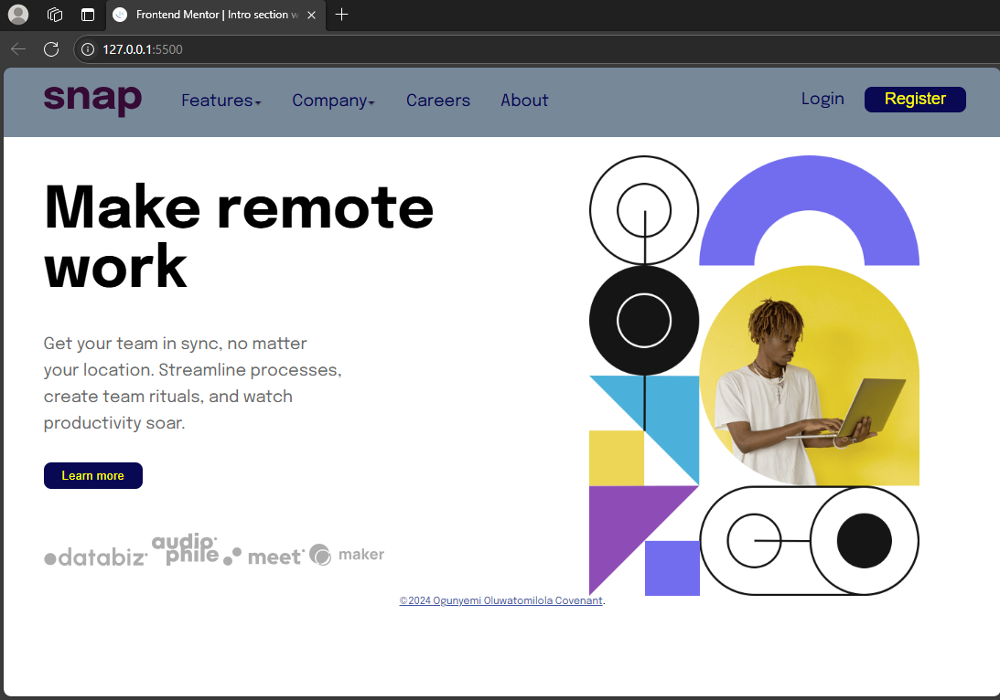

# Frontend Mentor - Intro section with dropdown navigation solution

This is a solution to the [Intro section with dropdown navigation challenge on Frontend Mentor](https://www.frontendmentor.io/challenges/intro-section-with-dropdown-navigation-ryaPetHE5).

## Table of contents

[The challenge](#the-challenge)
[Screenshot](#screenshot)
[Links](#links)

[Built with](#built-with)
[What I learned](#what-i-learned)
[Author](#author)

### The challenge

Users should be able to:

- View the relevant dropdown menus on desktop and mobile when interacting with the navigation links
- View the optimal layout for the content depending on their device's screen size
- See hover states for all interactive elements on the page

### Screenshot

Screenshot of desktop view.

Screenshot of mobile view.

### Links

- Solution URL: https://github.com/Covenant-0/into-section-with-dropdown-navigation
- Live Site URL: https://covenant-0.github.io/into-section-with-dropdown-navigation

### Built with

- Semantic HTML5 markup
- CSS custom properties
- Flexbox
- CSS Grid
- Mobile-first workflow
- Javascript
- [Styled Components](https://styled-components.com/) - For styles

### What I learned
I learnt the proper use of javascript and css in improving the functionality of the website.

## Author

- Github - https://github.com/Covenant-0
- Frontend Mentor - https://www.frontendmentor.io/home
